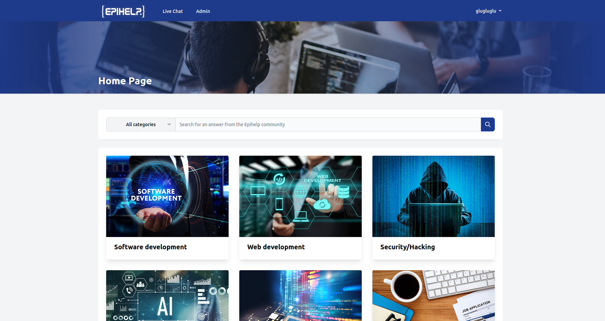

# EPIHELP

This is a forum website for all the students from Epitech to discuss about their problems in their school life.
Frontend is built with React.js with TypeScript and Backend is with Laravel. MongoDB Atlas is used as database.

<!-- ## To Run the project

### Backend
- open epihelp-backend
- create a .env file
- copy paste the .env.example content in the .env file
- replace APP_URL=http://localhost with the two lines below:
  APP_URL=http://localhost:8000
  FRONTEND_URL=http://localhost:3000
- run command: php artisan key:generate
               composer install
               php artisan serve

### Frontend 
- open another terminal and open epihelp-frontend
- run command: npm i --legacy-peer-deps
               npm start  -->

## Usage (development) 

### Server Side 

The first step of the project is to launch Docker on your project (https://www.docker.com/) as a way to use the dockerized backend of the project. 

Then you'll launch the proper container with the command: 

docker run -p 8000:8000 nicrobret/epihelp-backend 

- if everything works as planned you should see “Starting Laravel development server: 
 http://0.0.0.0:8000” on your terminal 

- If you get:  
docker: Error response from daemon: driver failed programming external connectivity on endpoint busy_banach (errorcode): Bind for 0.0.0.0:8000 failed: port is already allocated. 
ERRO[0000] error waiting for container: context canceled 
Close every other instance of Docker that are running on your project/computer. 

### Live chat microservice 
You will then have to run the chat backend:
cd chat-server 
npm i 
npm start 

You should have  
> chat-server@0.0.0 start 
> node ./bin/www 

### Client Side 

Finally, you will head to the front part of the project (with your backend running) 
cd epihelp-frontend 
npm i --legacy-peer-deps  
npm start 

Compiled successfully! 

You can now view epihelp in the browser. 
Local: http://localhost:3000 
Now head to localhost 3000 and you are good to go! 